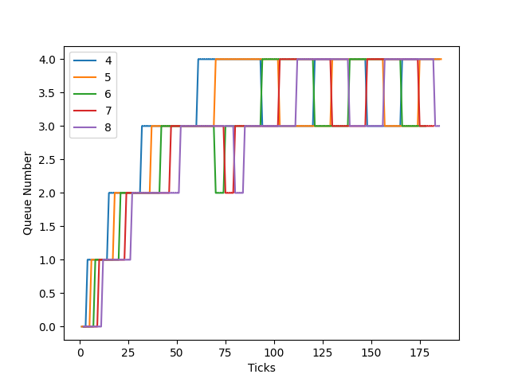

# Assignment 5 - XV6 Report

## `waitx`
This is a modification of the pre-existing wait function. It calculates rtime by incrementing it each time ticks is incremented and wtime is calculated by 
```c
*wtime = p->etime - (p->ctime + p->rtime + p->iotime);
```
Here etime is the exit time of the process, ctime is creation time, rtime is run time and iotime is the time used in doing I/O operations.

## `time`
This is a simple user defined function which can be used to check waitx system call.

## `ps`
This is used to get info of the active processes. It is implemented in **myps** function in proc.c. It returns the status, r_time, n_runs, time spent in each queue and current queue number (in the case of MLFQ).

## `set_priority`
This is a system call used to change the priority of processes in case of PBS scheduler.

## `setPriority`
This is a user defined function which can be used to change the priority of background processes in PBS scheduler. It employes **set_priority** system call in background.

## `benchmark`
This is a user defined function which can be used to check the various schduling algorithms. It uses fork and creates child processes and prints when they end. It can be modified for checking.

## Scheduling Algorithms
### `FCFS`
It selects the processes based on the creation time. The process which is runnable and has the minimum creation time is selected by the CPU.

### `PBS`
It selects the processes based on the priority. The process which is runnable and has the highest priority (lowest value) is selected by the CPU.

### `MLFQ`
The scheduler has been implemented as mentioned in the assignment pdf.  

Scheduler Details:  
1. Create five priority queues, with the highest priority being number as 0 and the bottom queue with the lowest priority as 4.
2. Assign a suitable value for 1 tick of CPU timer.
3. ​The time-slice for priority 0 should be 1 timer tick. The times-slice for priority 1 is 2 timer ticks; for priority 2, it is 4 timer ticks; for priority 3, it is 8 timer ticks; for priority 4, it is 16 timer ticks.  

Procedure:  
1. On the initiation of a process, push it to the end of the highest priority queue.
2. The highest priority queue should be running always, if not empty.
3. ​ If the process completes, it leaves the system.
4. ​ If the process uses the complete time slice assigned for its current priority queue, it is preempted and ​ inserted at the end of the next lower level queue.
5. If a process voluntarily relinquishes control of the CPU, it leaves the queuing network, and when the process becomes ready again after the I/O, it is​ ​ inserted
at the tail of the same queue, from which it is relinquished earlier​ ​ 
6. A round-robin scheduler should be used for processes at the lowest priority queue.
7. To prevent starvation, aging is implemented.  

### Report
This was calculated by running 4 processes under similar conditions in different algorithms.
***RR***
|Process|Run Time|Waiting Time|
|-------|--------|------------|
|P0|31|92|
|P1|31|93|
|P2|32|96|
|P3|31|94|
***FCFS***
|Process|Run Time|Waiting Time|
|-------|--------|------------|
|P0|31|1|
|P1|33|32|
|P2|31|64|
|P3|31|96|
***PBS***  
Priority of P1 = Priority of P3  
Priority of P0 = Priority of P2  
Priority of P2 > P1

|Process|Run Time|Waiting Time|
|-------|--------|------------|
|P0|30|32|
|P2|32|32|
|P1|31|96|
|P3|32|95|

***MLFQ***
|Process|Run Time|Waiting Time|
|-------|--------|------------|
|P3|31|84|
|P0|33|88|
|P1|32|92|
|P2|32|96|

The waiting time for the FCFS is lowest as it does not waste time to choose process and directly takes the process with lowest creation time. It is less than waiting time of PBS due to pre-emption of PBS which causes CPU to lose valuable time by choosing process again and again. The waiting time of MLFQ is high becuase a lot of time is spent in choosing processes, aging, demoting etc. The waiting time of RR is high due to continuous process change which causes CPU to reduce effeciency.

>MLFQ can be exploited by the programmer by adding a small I/O burst with frequency less than the time slice of the queue. This will cause the process to be removed from the queue and be added back to the same queue again (highest priority). This will result in that process to be in the same queue again and again and be finished with the highest priority (in the highest queue).

## Queue Changes in MLFQ
